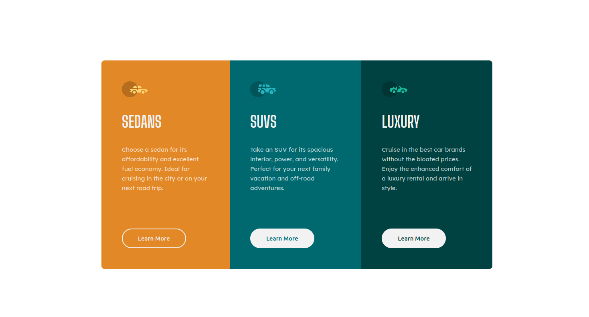

# Frontend Mentor - 3-column preview card component solution

This is a solution to the [3-column preview card component challenge on Frontend Mentor](https://www.frontendmentor.io/challenges/3column-preview-card-component-pH92eAR2-). 

## Table of contents

- [Overview](#overview)
  - [The challenge](#the-challenge)
  - [Screenshot](#screenshot)
 	* [Desktop](#desktop)
 	* [Mobile](#mobile)
  - [Links](#links)
- [My process](#my-process)
  - [Built with](#built-with)
  - [What I learned](#what-i-learned)

## Overview

### The challenge

Users should be able to:

- View the optimal layout depending on their device's screen size
- See hover states for interactive elements

### Screenshot

#### Desktop



#### Mobile


### Links

- Solution URL: [Github=](https://your-solution-url.com)
- Live Site URL: [Github pages](https://your-live-site-url.com)

## My process

### Built with

- Semantic HTML5 markup
- CSS custom properties
- Flexbox
- CSS Grid
- Mobile-first workflow

### What I learned

Thanks to this challenge I learned more about flexbox. I used it with `min-width` attribute to avoid writing too much media queries.

```css
.main-window {
  display: flex;
  width: 65%;
  min-width: 46rem;
	...
}
```
